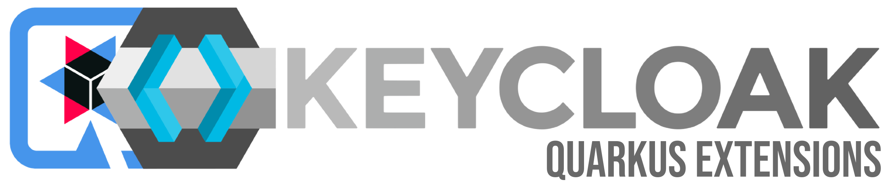

# Keycloak Quarkus Extensions

**Easily add Quarkus/Quarkiverse extension to your Keycloak distribution.**

The principle is quite basic as it mimics the process of building Keycloak distribution for the main Keycloak.
It will just include all Quarkus/Quarkiverse extensions in the distribution.

**INFO**: Work is still in a progress and code MAY change!

```shell
Add Quarkus/Quarkiverse extensions to your Keycloak deployment

Usage: ./kc-extension.sh [OPTIONS] <command>

Options:
  -h, --help                Display this help message.

Commands:
  add    <extension>        Add Quarkus/Quarkiverse extension.
  add    <GAV>              Manually add Quarkiverse or your own extension to the project by specifying <groupId:artifactId:version>.
  build                     Rebuild the Keycloak distribution with custom extensions.
  list                      Display all available extensions.
  start-dev                 Execute the generated Keycloak distribution in development mode.
  image                     Build extended Keycloak builder image with your custom extensions.
```

For more advanced use-cases, see the [Configuration guides](examples/README.md#configuration).

## Your first extended Keycloak

How to add your first extensions to your Keycloak deployment? Follow this simple guidelines:

```shell 
# Add official Quarkus extension
./kc-extension.sh add <extension-name>

# Add Quarkiverse extension by specifying the whole GAV
./kc-extension.sh add <groupId:artifactId:version>

# Add the necessary Quarkus properties in 'quarkus.properties' file

# Build the extended Keycloak distribution
./kc-extension.sh build

# Try it out by starting the extended distribution in dev mode
./kc-extension.sh start-dev
```

Now, you should be able to access extended nightly Keycloak instance at `localhost:8080`.

The `build` command generates extended Keycloak distribution as files:

* `keycloak-extended-{version}.tar.gz`
* `keycloak-extended-{version}.zip`

Where the `version` represents the specific version of Keycloak.
For more options how to build the distribution, execute `./kc-extensions.sh build --help`.

## Container

Do you want to use extended Keycloak as a container image?
We provide command `image` that builds image, which purpose is to be a `builder` image in your Containerfile/Dockerfile
as described
in [Writing your optimized Keycloak Containerfile](https://www.keycloak.org/server/containers#_writing_your_optimized_keycloak_containerfile).

For more options, execute `./kc-extension.sh image --help`.

### Create a builder image

To create the builder image, execute:

```shell
./kc-extension.sh image
```

It will create an image `keycloak-extended` with tag of used version (`nightly` by default).

**INFO**: If you use `docker` instead of `podman`, you should add option `--use-docker`.

It can be used in your Containerfile/Dockerfile as follows:

```Dockerfile
FROM localhost/keycloak-extended:nightly AS builder
```

**INFO**: You can push the image to more available sources

### Create an optimized enhanced image

As mentioned in the
guide [Writing your optimized Keycloak Containerfile](https://www.keycloak.org/server/containers#_writing_your_optimized_keycloak_containerfile),
you can create your own optimized image.
The builder image might be used as shown in the [Containerfile-example](Containerfile-example):

```Dockerfile
FROM localhost/keycloak-extended:nightly AS builder

ENV KC_HEALTH_ENABLED true
ENV KC_METRICS_ENABLED=true

# Put your build-time config options

RUN /opt/keycloak/bin/kc.sh build

FROM localhost/keycloak-extended:nightly
COPY --from=builder /opt/keycloak/ /opt/keycloak/

# Put your runtime config options

ENTRYPOINT ["/opt/keycloak/bin/kc.sh"]
```

Note the used builder image `keycloak-extended:nightly` created by us.

The optimized image can be created as follows:

```shell
podman build --tag my-extended-keycloak -f Containerfile-example .
```

### Start the optimized image

We have created the optimized image and we can start it as mentioned in the [Container](https://www.keycloak.org/getting-started/getting-started-podman) guide, and as follows:

```shell
podman run -p 8080:8080 \
-e KC_BOOTSTRAP_ADMIN_USERNAME=admin \
-e KC_BOOTSTRAP_ADMIN_PASSWORD=admin \
my-extended-keycloak \
start --hostname-strict=false --http-enabled=true --optimized
```

You should see the extended Keycloak accessible at `localhost:8080`.

**INFO**: Use `docker` if you don't use `podman`.

## Examples

For more examples how to configure the tool or add Quarkus/Quarkiverse extensions, see the [examples](examples) directory.
